# 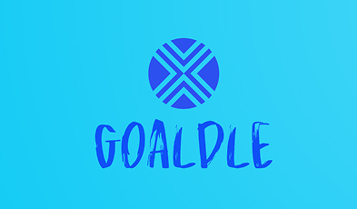

## 📌 Opis projektu
**Goaldle** to codzienna dawka quizów, które pozwalają na rozrywkę i pogłówkowanie w celu zgadnięcia poprawnego piłkarza z TOP 5 lig europejskich. Główne funkcje aplikacji obejmują dwa quizy: jeden, w którym trzeba znaleźć piłkarza po podpowiedziach wyświetlanych w oknie, oraz drugi, w którym celem jest odgadnięcie piłkarza na podstawie informacji o transferze. W bazie danych przechowywane są informacje o piłkarzach, transferach, odpowiedziach użytkowników, takich jak ilość prób zgadywania oraz informacja, czy użytkownik zgadł piłkarza danego dnia.

---

# ⚙️ **Działanie**

## 1️⃣ Rejestracja i Logowanie
### 🔹 Rejestracja  
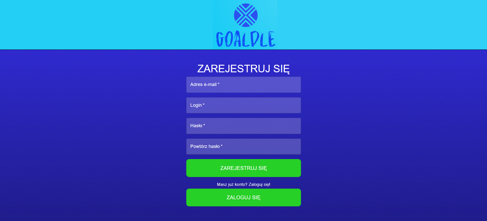  

### 🔹 Logowanie  
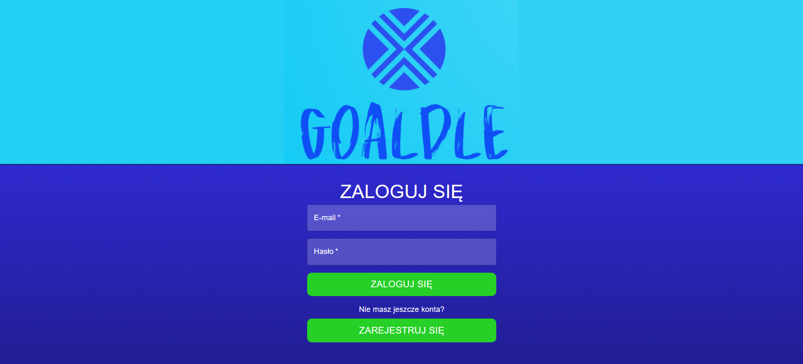  

---

## 2️⃣ Strona główna ze wszystkimi opcjami, trybami quizów i listą piłkarzy z opcjami filtrowania i sortowania  
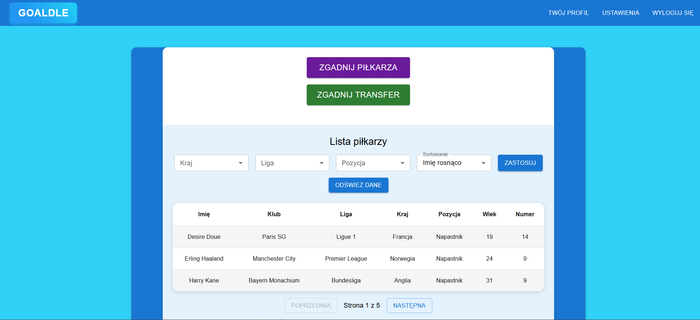  

---

## 3️⃣ Twój profil 
Pokazuje datę założenia konta, osiągnięcia użytkownika oraz umożliwia zmianę zdjęcia profilowego.
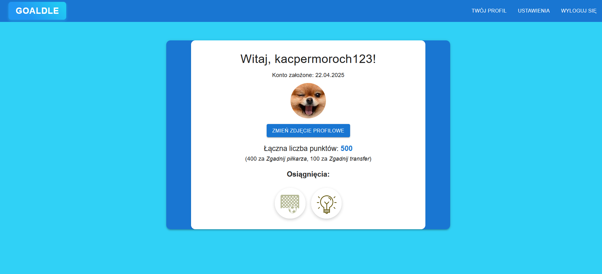  

---

## 4️⃣ Panel Administratora 
Umożliwiający przeglądanie i usuwanie użytkowników z bazy. 
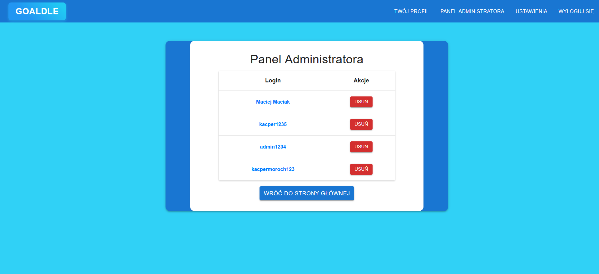
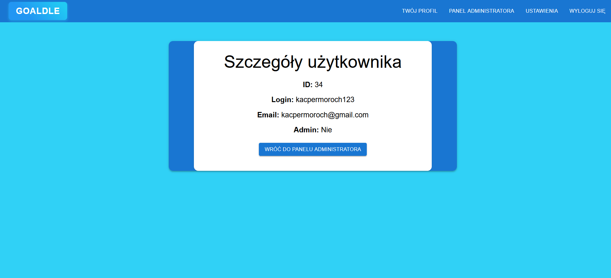    

---

## 5️⃣ Ustawienia użytkownika  
Umożliwiają zmianę loginu i e-maila użytkownika oraz pozwalają na usunięcie konta.  
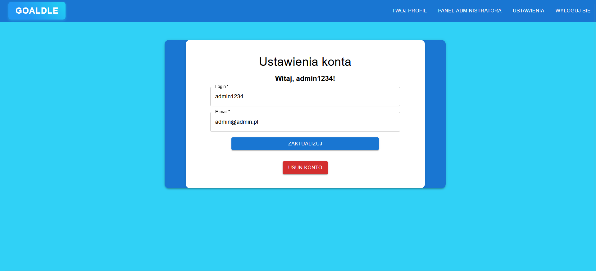  

---

## 6️⃣ Codzienny Tryb "Zgadnij Piłkarza"  
Tryb polega na odgadnięciu losowego piłkarza z TOP 5 lig europejskich.  
Po wpisaniu nazwy piłkarza w oknie pojawiają się podpowiedzi, które atrybuty naszego piłkarza zgadzają się z piłkarzem do odgadnięcia.  
  
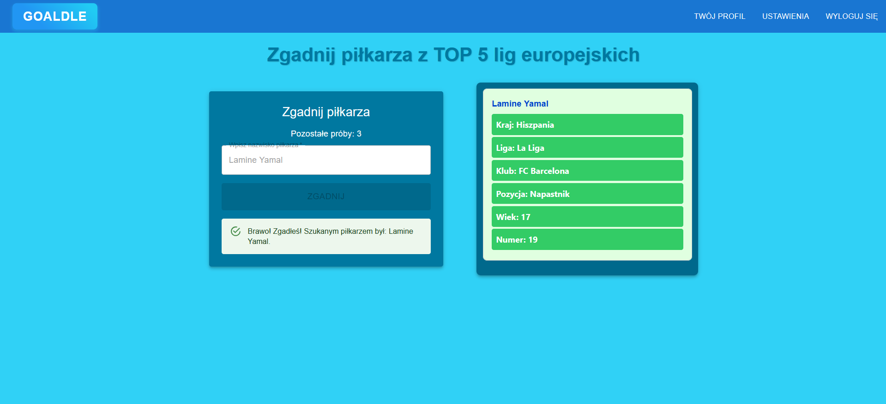

---

## 7️⃣ Codzienny Tryb "Zgadnij Transfer"  
Gracz musi odgadnąć piłkarza, który brał udział w transferze wyświetlonym na ekranie.  
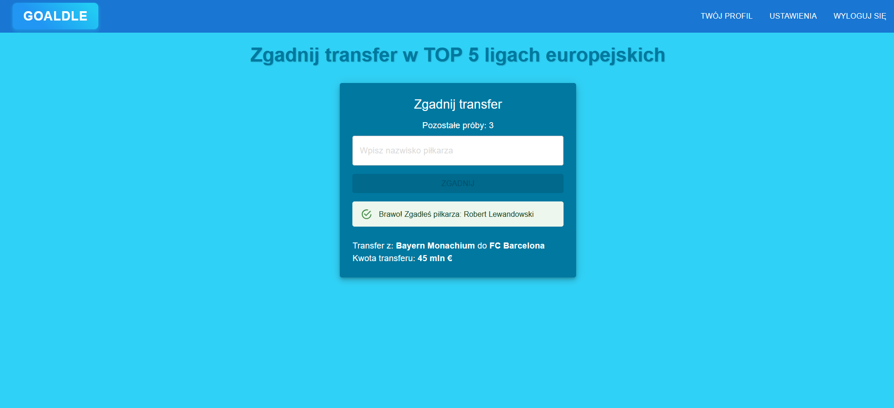 

---

## 📊 Diagram ERD  
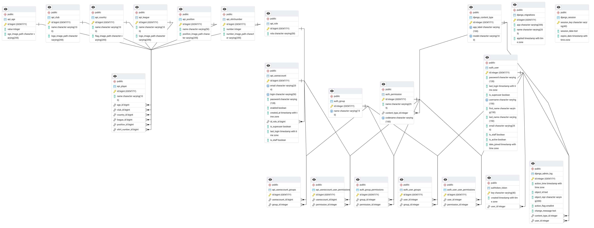  

---

## :floppy_disk: Baza danych
[Moja Baza Danych](backup.sql)  

# 🛠 **Technologie użyte w projekcie**

✅ **FRONTEND:** React  
✅ **BACKEND:** Django  
✅ **BAZA DANYCH:** PostgreSQL 

---

## 👤 **Autor aplikacji**  
@KacperMoroch  