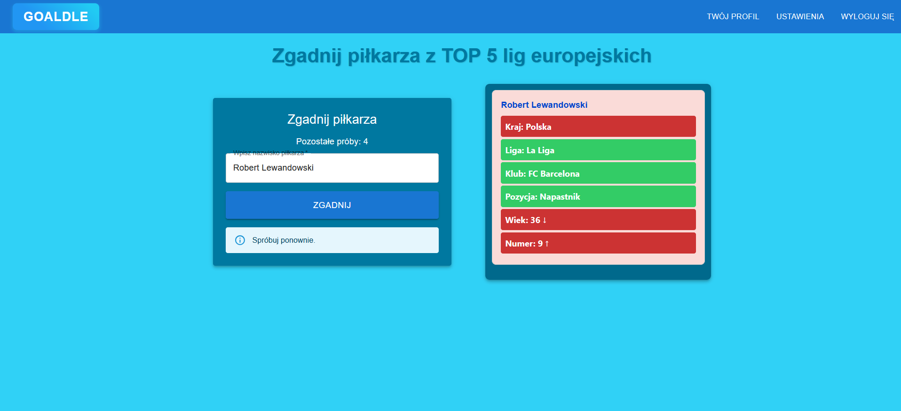

<p align="center">
  
</p>

## 📌 Opis projektu
**Goaldle** to codzienna dawka quizów, które pozwalają na rozrywkę i pogłówkowanie w celu zgadnięcia poprawnego piłkarza z TOP 5 lig europejskich. Główne funkcje aplikacji obejmują dwa quizy: jeden, w którym trzeba znaleźć piłkarza po podpowiedziach wyświetlanych w oknie, oraz drugi, w którym celem jest odgadnięcie piłkarza na podstawie informacji o transferze. W bazie danych przechowywane są informacje o piłkarzach, transferach, odpowiedziach użytkowników, takich jak ilość prób zgadywania oraz informacja, czy użytkownik zgadł piłkarza danego dnia.

---
## 📐 Schemat architektury

    ┌────────────────────────────┐                                        ┌─────────────────────────────┐
    │     Frontend (React)       │                                        │       Backend (Django)      │
    │                            │                                        │                             │
    │  - React Router            |                                        │  - Django REST Framework    │
    │  - JWT Auth                |───────────HTTP/HTTPS Requests─────────>│  - JWT (SimpleJWT)          │
    │  - Base64                  │                                        │  - Swagger                  │
    │                            │                                        │  - RabbitMQ producer        │
    └────────────────────────────┘                                        └─┬─────────────────────────┬─┘
                                                                            │                         │
                                                                            │                         │
                                                                   DataBase (PostgreSQL)        RabbitMQ Queue
                                                                            ˄                         │
                                                                            │                 [Consumer + SMTP]
                                                                            │
                                                                            │
                                                                   ┌──────────────────┐
                                                                   │    Modele        │
                                                                   │ - UserAccount    │
                                                                   │ - Player         │
                                                                   │ - itd.           │
                                                                   └──────────────────┘
---

## ▶️ Instrukcja uruchomienia projektu

### Wymagania:
- Docker
- Docker Desktop

### 🔥 Uruchomienie aplikacji:

1. Backend (w katalogu `backend`):

   ```terminal
   docker-compose up --build -d
   ```
2. Frontend w (w katalogu `ui-app`):

   ```terminal
   npm i
   ```

   a później

    ```terminal
    npm run dev
    ``` 

3. Adresy aplikacji:

   - **Frontend:** `http://localhost:5173`
   - **Backend/API:** `http://localhost:8000/`
   - **Swagger:** `http://localhost:8000/api/docs/`
   - **RabbitMQ Management:** `http://localhost:15672` (login: `guest`, hasło: `guest`)
  

## 📚 Dokumentacja API

- Swagger: http://localhost:8000/api/docs/
- Redoc: http://localhost:8000/api/redoc/

# ⚙️ **Działanie**

## 1️⃣ Rejestracja i Logowanie
### 🔹 Rejestracja  
  

### 🔹 Logowanie  
  

---

## 2️⃣ Strona główna ze wszystkimi opcjami, trybami quizów i listą piłkarzy z opcjami filtrowania i sortowania  
  

---

## 3️⃣ Twój profil 
Pokazuje datę założenia konta, osiągnięcia użytkownika oraz umożliwia zmianę zdjęcia profilowego.
  

---

## 4️⃣ Panel Administratora 
Umożliwiający przeglądanie i usuwanie użytkowników z bazy. 

    

---

## 5️⃣ Ustawienia użytkownika  
Umożliwiają zmianę loginu i e-maila użytkownika oraz pozwalają na usunięcie konta.  
  

---

## 6️⃣ Codzienny Tryb "Zgadnij Piłkarza"  
Tryb polega na odgadnięciu losowego piłkarza z TOP 5 lig europejskich.  
Po wpisaniu nazwy piłkarza w oknie pojawiają się podpowiedzi, które atrybuty naszego piłkarza zgadzają się z piłkarzem do odgadnięcia.  
  


---

## 7️⃣ Codzienny Tryb "Zgadnij Transfer"  
Gracz musi odgadnąć piłkarza, który brał udział w transferze wyświetlonym na ekranie.  
 

---

## 📊 Diagram ERD  
  

---

## :floppy_disk: Baza danych
[Moja Baza Danych](backup.sql)  

---

# 🛠 **Technologie użyte w projekcie**

| Technologia | Opis i uzasadnienie |
|-------------|---------------------|
| **React** | Nowoczesny framework frontendowy do tworzenia dynamicznych interfejsów typu SPA, zapewnia płynne przejścia i szybkie renderowanie komponentów. |
| **Django REST Framework** | Rozbudowany zestaw narzędzi do budowania REST API w Django – przyspiesza tworzenie i testowanie backendu. |
| **JWT (SimpleJWT)** | Mechanizm autoryzacji oparty na tokenach – pozwala na bezpieczne i skalowalne zarządzanie sesją użytkownika w aplikacjach typu frontend-backend. |
| **PostgreSQL** | Stabilna, wydajna baza danych relacyjna, dobrze współpracująca z Django ORM i obsługująca zaawansowane zapytania. |
| **drf_yasg** | Generowanie automatycznej dokumentacji API w formacie Swagger lub ReDoc – ułatwia testowanie i rozwój interfejsów backendowych. |
| **SMTP (Gmail)** | Konfiguracja do wysyłania maili transakcyjnych (np. wiadomości powitalne) za pomocą serwera Gmail. |
| **Base64 (obrazy)** | Metoda kodowania obrazów jako tekst, co pozwala łatwo przesyłać dane graficzne przez API bez potrzeby zarządzania plikami. |
| **RabbitMQ** | System kolejkowania wiadomości, wykorzystywany np. do asynchronicznego przetwarzania zdarzeń jak wysyłka maili powitalnych po rejestracji. |
| **Pytest** | Framework testujący dla Pythona – używany do automatyzacji testów jednostkowych i integracyjnych logiki backendu oraz endpointów. |

---

## 👤 **Autor aplikacji**  
@KacperMoroch
